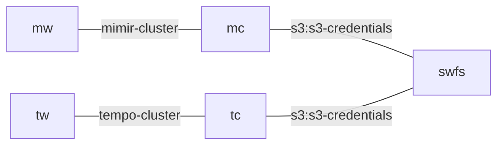

# seaweedfs-k8s-operator
[](https://charmhub.io/seaweedfs-k8s)


## Purpose
This charm is intended to be used as a stand-in for s3-integrator + (micro)ceph for testing purposes.
When testing charms, instead of deploying (micro)ceph, s3-integrator, setting config options and
running the sync-credentials action, this charm mimics the s3 relation interface and provides an
s3 endpoint.

## Compared to s3-integrator
### Relation data
This charm does not use the s3 library. Instead, it renderes the relation data itself.
For a related charm, relation data may look like this:

```yaml
  - relation-id: 7
    endpoint: s3
    related-endpoint: s3-credentials
    application-data:
      access-key: placeholder
      bucket: s3-credentials-7
      endpoint: http://swfs-0.swfs-endpoints.welcome-k8s.svc.cluster.local:8333
      secret-key: placeholder
```

Note that the bucket name is automatically derived from the relation id. No config options needed.

### Bucket name
In the past there has been some confusion about who decides on the bucket name - the requesting charm
(e.g. mimir, loki, tempo), or the s3-integrator charm. It seems like everyone agrees now that it's the
s3-integrator where the bucket name should be set (via config option).

In this charm, the same principle holds, but there is no config option for bucket name, because:
1. For testing purposes, we don't care that the bucket name is not fixed.
2. This way we could relate multiple charms to the same seaweedfs charm, unlike s3-integrator where each
   app (mimir, loki, tempo) have their own s3-integrator due to different bucket names.

## Usage example
Here's a sample bundle



```yaml
bundle: kubernetes
applications:
  mc:
    charm: mimir-coordinator-k8s
    channel: 1/edge
    revision: 43
    base: ubuntu@22.04/stable
    resources:
      nginx-image: 14
      nginx-prometheus-exporter-image: 4
    scale: 1
    constraints: arch=amd64
  mw:
    charm: mimir-worker-k8s
    channel: 1/edge
    revision: 50
    base: ubuntu@22.04/stable
    resources:
      mimir-image: 16
    scale: 1
    options:
      role-all: true
    constraints: arch=amd64
    trust: true
  swfs:
    charm: seaweedfs-k8s
    channel: edge
    revision: 5
    base: ubuntu@24.04/stable
    scale: 1
    constraints: arch=amd64
  tc:
    charm: tempo-coordinator-k8s
    channel: 1/edge
    revision: 79
    base: ubuntu@22.04/stable
    resources:
      nginx-image: 7
      nginx-prometheus-exporter-image: 4
    scale: 1
    constraints: arch=amd64
    trust: true
  tw:
    charm: tempo-worker-k8s
    channel: 1/edge
    revision: 59
    base: ubuntu@22.04/stable
    resources:
      tempo-image: 6
    scale: 1
    options:
      role-all: true
    constraints: arch=amd64
    trust: true
relations:
- - mc:s3
  - swfs:s3-credentials
- - mw:mimir-cluster
  - mc:mimir-cluster
- - tw:tempo-cluster
  - tc:tempo-cluster
- - tc:s3
  - swfs:s3-credentials
```

## Manual testing
```bash
# Refs:
# https://github.com/seaweedfs/seaweedfs/blob/master/docker/compose/local-filer-backup-compose.yml
# https://github.com/seaweedfs/seaweedfs/blob/master/.github/workflows/s3tests.yml

curl --fail -I http://localhost:9333/cluster/healthz

# Master server
curl -s http://localhost:9333/cluster/status

# Volume server
curl -s http://localhost:8080/status

# Filer
curl -s http://localhost:8888/

# S3 server
curl -s http://localhost:8000/
```
