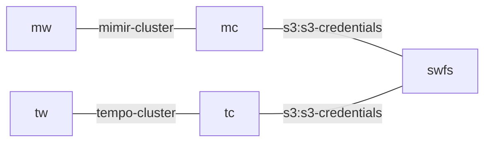

# seaweedfs-k8s-operator
[](https://charmhub.io/seaweedfs-k8s)

## Purpose
This charm packages [SeaweedFS](https://github.com/seaweedfs/seaweedfs) as a self-clustering,
S3-compatible object storage backend. It is equally useful for two very different situations:

- **Testing other charms.** Deploy a single unit as a lightweight, disposable stand-in for
  `s3-integrator` + (micro)ceph whenever a charm under test needs an S3 endpoint, without the
  setup/config/sync-credentials dance that the real thing requires.
- **Real home-lab storage.** `juju add-unit` to grow the very same deployment into a genuinely
  replicated, highly-available storage cluster -- a practical, low-maintenance replacement for
  minio or ceph/radosgw.

There is no separate "production mode" to switch on: the charm always auto-configures itself
based on how many units are present.

## Scale-out, zero-touch clustering
Units discover each other automatically using their stable in-cluster Kubernetes DNS names
(`<app>-<N>.<app>-endpoints.<namespace>.svc.cluster.local`) -- no peer configuration, load
balancer, or extra charms required. Simply:

```bash
juju deploy seaweedfs-k8s swfs
juju add-unit swfs -n 2   # now 3 units: a real, replicated cluster
```

- Up to 5 units form the SeaweedFS master/Raft quorum (Raft only tolerates an *odd* number of
  voting members); any further units join purely as storage/gateway nodes that still talk to that
  fixed set of masters.
- Data is automatically replicated once enough units (failure domains) exist: 0 extra copies on a
  single unit, up to 2 extra copies (3 total, mirroring Ceph's own default) once 3+ units are
  present. Override with the `replication` config option if you know the
  [SeaweedFS replica placement format](https://github.com/seaweedfs/seaweedfs/wiki/Replication)
  and want something different.
- `juju remove-unit` shrinks the cluster just as smoothly, re-electing the Raft quorum as needed.

## Secure by default
Earlier versions of this charm exposed an anonymous identity with full read/write/admin rights --
fine for a throwaway test double, not something you want guarding your family photos. Every
credential is now randomly generated at deploy time and there is no anonymous access:

- An **admin** identity is created for the charm's own use (e.g. to create the default bucket) and
  can be retrieved for manual/home-lab use via the `get-admin-credentials` action.
- Every related application via `s3-credentials` gets its **own** access/secret key pair, scoped
  (via SeaweedFS's bucket-suffixed action grants) to **only** the bucket it owns -- one related
  charm can never read or write another's bucket.
- Credentials are shared across all units of the cluster through a single Juju secret, so every
  unit's independent S3 gateway process authenticates requests consistently.

```bash
juju run swfs/leader get-admin-credentials
```
```
access-key: <redacted>
secret-key: <redacted>
endpoint: http://swfs-0.swfs-endpoints.welcome-k8s.svc.cluster.local:8333
endpoints: http://swfs-0...:8333,http://swfs-1...:8333,http://swfs-2...:8333
```

## Configuration
| Option | Default | Description |
| --- | --- | --- |
| `bucket` | `default-bucket` | Bucket automatically created using the admin identity. Set to `""` to disable. |
| `replication` | `auto` | SeaweedFS replica placement string, or `auto` to derive one from unit count (see above). |
| `volume-size-limit-mb` | `1024` | Maximum size (MB) of each underlying SeaweedFS volume. |

## Compared to s3-integrator
### Relation data
This charm does not use the s3 library. Instead, it renders the relation data itself.
For a related charm, relation data may look like this:

```yaml
  - relation-id: 7
    endpoint: s3
    related-endpoint: s3-credentials
    application-data:
      access-key: <randomly generated, unique to this relation>
      bucket: s3-credentials-7
      endpoint: http://swfs-0.swfs-endpoints.welcome-k8s.svc.cluster.local:8333
      secret-key: <randomly generated, unique to this relation>
```

Note that the bucket name is automatically derived from the relation id. No config options needed.

### Bucket name
In the past there has been some confusion about who decides on the bucket name - the requesting
charm (e.g. mimir, loki, tempo), or the s3-integrator charm. It seems like everyone agrees now that
it's the s3-integrator where the bucket name should be set (via config option).

In this charm, the same principle holds, but there is no config option for the per-relation bucket
name, because:
1. For testing purposes, we don't care that the bucket name is not fixed.
2. This way we could relate multiple charms to the same seaweedfs charm, unlike s3-integrator where
   each app (mimir, loki, tempo) have their own s3-integrator due to different bucket names.

## Usage example
Here's a sample bundle


```mermaid
graph LR
mc ---|s3:s3-credentials| swfs
mw ---|mimir-cluster| mc
tw ---|tempo-cluster| tc
tc ---|s3:s3-credentials| swfs
```

```yaml
bundle: kubernetes
applications:
  mc:
    charm: mimir-coordinator-k8s
    channel: 1/edge
    revision: 43
    base: ubuntu@22.04/stable
    resources:
      nginx-image: 14
      nginx-prometheus-exporter-image: 4
    scale: 1
    constraints: arch=amd64
  mw:
    charm: mimir-worker-k8s
    channel: 1/edge
    revision: 50
    base: ubuntu@22.04/stable
    resources:
      mimir-image: 16
    scale: 1
    options:
      role-all: true
    constraints: arch=amd64
    trust: true
  swfs:
    charm: seaweedfs-k8s
    channel: edge
    revision: 5
    base: ubuntu@24.04/stable
    scale: 1
    constraints: arch=amd64
  tc:
    charm: tempo-coordinator-k8s
    channel: 1/edge
    revision: 79
    base: ubuntu@22.04/stable
    resources:
      nginx-image: 7
      nginx-prometheus-exporter-image: 4
    scale: 1
    constraints: arch=amd64
    trust: true
  tw:
    charm: tempo-worker-k8s
    channel: 1/edge
    revision: 59
    base: ubuntu@22.04/stable
    resources:
      tempo-image: 6
    scale: 1
    options:
      role-all: true
    constraints: arch=amd64
    trust: true
relations:
- - mc:s3
  - swfs:s3-credentials
- - mw:mimir-cluster
  - mc:mimir-cluster
- - tw:tempo-cluster
  - tc:tempo-cluster
- - tc:s3
  - swfs:s3-credentials
```

For real storage, just bump `scale` on `swfs` (e.g. to `3`) to form a replicated cluster from the
start, or scale it up later with `juju add-unit`.

## Manual testing
```bash
juju ssh --container seaweedfs swfs/0 /charm/bin/pebble logs -f | grep -iE "error|fail"

# Make sure size is growing
juju ssh --container seaweedfs swfs/0 du -hc /data
```

```bash
# Refs:
# https://github.com/seaweedfs/seaweedfs/blob/master/docker/compose/local-filer-backup-compose.yml
# https://github.com/seaweedfs/seaweedfs/blob/master/.github/workflows/s3tests.yml

UNIT=$(juju status --format=yaml | yq '.applications.swfs.units.swfs/0.address')

curl --fail -I http://$UNIT:9333/cluster/healthz

# Master server
curl -s http://$UNIT:9333/cluster/status

# Volume server (no auth required)
curl -s http://$UNIT:8080/status

# Filer
curl -s http://$UNIT:8888/

# S3 server (requires credentials -- see below; anonymous access is rejected)
curl -s http://$UNIT:8333/
```

```bash
sudo apt install s3cmd

# Fetch the auto-generated admin credentials
ACCESS_KEY=$(juju run swfs/leader get-admin-credentials --format=yaml | yq '.swfs/0.results."access-key"')
SECRET_KEY=$(juju run swfs/leader get-admin-credentials --format=yaml | yq '.swfs/0.results."secret-key"')

s3cmd --host=$UNIT:8333 --access_key=$ACCESS_KEY --secret_key=$SECRET_KEY --host-bucket= --no-ssl ls
s3cmd --host=$UNIT:8333 --access_key=$ACCESS_KEY --secret_key=$SECRET_KEY --host-bucket= --no-ssl mb s3://loki
```
