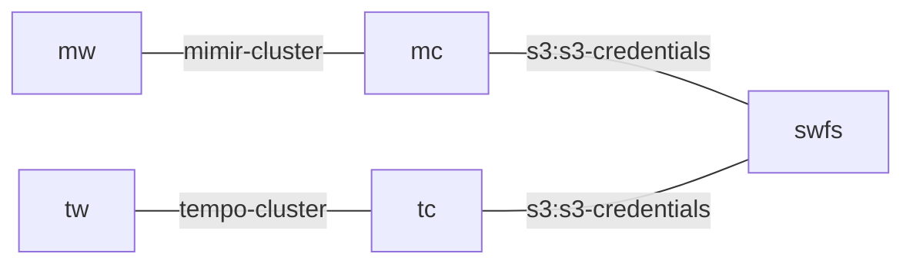

# seaweedfs-k8s-operator
[](https://charmhub.io/seaweedfs-k8s)


## Purpose
This charm provides S3-compatible object storage backed by
[SeaweedFS](https://github.com/seaweedfs/seaweedfs). It can be used as a
stand-in for `s3-integrator` in tests, and as real object storage for small
deployments and home labs, replacing MinIO or Ceph RADOS Gateway behind the
same `s3` relation interface.

## Scaling
Every unit joins one storage cluster automatically. The first unit runs the
cluster master and filer; all units run a volume server and an S3 gateway:

```bash
juju deploy seaweedfs-k8s --channel edge
juju add-unit seaweedfs-k8s            # adds storage capacity and a S3 gateway
```

No peer or endpoint configuration is needed. Data volumes are replicated
according to the `replication` config option (see below).

## Credentials
S3 credentials are generated on first start and stored in application data.
Consumers receive the endpoint, `access-key`, `secret-key`, and a bucket name
through the `s3-credentials` relation. Each relation gets its own bucket, so a
single SeaweedFS application can serve several consumers at once.

## Compared to s3-integrator
### Relation data
This charm does not use the s3 library. Instead, it renders the relation data
itself. For a related charm, relation data looks like this:

```yaml
  - relation-id: 7
    endpoint: s3
    related-endpoint: s3-credentials
    application-data:
      access-key: 5f2c9a1e4b7d8c0a3e6f
      bucket: s3-credentials-7
      endpoint: http://swfs-0.swfs-endpoints.welcome-k8s.svc.cluster.local:8333
      secret-key: 9d1f...redacted...
```

Note that the bucket name is automatically derived from the relation id. No
config options are needed.

## Configuration
- `bucket` — an extra bucket to create on startup, in addition to the
  per-relation buckets.
- `replication` — SeaweedFS replication placement for data volumes, as an XYZ
  string (default `001`: one extra copy on another volume server in the same
  rack). A single-unit deployment always uses `000`.

## Usage example
Here's a sample bundle


```mermaid
graph LR
mc ---|s3:s3-credentials| swfs
mw ---|mimir-cluster| mc
tw ---|tempo-cluster| tc
tc ---|s3:s3-credentials| swfs
```

```yaml
bundle: kubernetes
applications:
  mc:
    charm: mimir-coordinator-k8s
    channel: 1/edge
    revision: 43
    base: ubuntu@22.04/stable
    resources:
      nginx-image: 14
      nginx-prometheus-exporter-image: 4
    scale: 1
    constraints: arch=amd64
  mw:
    charm: mimir-worker-k8s
    channel: 1/edge
    revision: 50
    base: ubuntu@22.04/stable
    resources:
      mimir-image: 16
    scale: 1
    options:
      role-all: true
    constraints: arch=amd64
    trust: true
  swfs:
    charm: seaweedfs-k8s
    channel: edge
    revision: 5
    base: ubuntu@24.04/stable
    scale: 1
    constraints: arch=amd64
  tc:
    charm: tempo-coordinator-k8s
    channel: 1/edge
    revision: 79
    base: ubuntu@22.04/stable
    resources:
      nginx-image: 7
      nginx-prometheus-exporter-image: 4
    scale: 1
    constraints: arch=amd64
    trust: true
  tw:
    charm: tempo-worker-k8s
    channel: 1/edge
    revision: 59
    base: ubuntu@22.04/stable
    resources:
      tempo-image: 6
    scale: 1
    options:
      role-all: true
    constraints: arch=amd64
    trust: true
relations:
- - mc:s3
  - swfs:s3-credentials
- - mw:mimir-cluster
  - mc:mimir-cluster
- - tw:tempo-cluster
  - tc:tempo-cluster
- - tc:s3
  - swfs:s3-credentials
```

## Manual testing
```bash
juju ssh --container seaweedfs swfs/0 /charm/bin/pebble logs -f | grep -iE "error|fail"

# Make sure size is growing
juju ssh --container seaweedfs swfs/0 du -hc /data
```

```bash
# Refs:
# https://github.com/seaweedfs/seaweedfs/blob/master/docker/compose/local-filer-backup-compose.yml
# https://github.com/seaweedfs/seaweedfs/blob/master/.github/workflows/s3tests.yml

UNIT=$(juju status --format=yaml | yq '.applications.swfs.units.swfs/0.address')

curl --fail -I http://$UNIT:9333/cluster/healthz

# Master server
curl -s http://$UNIT:9333/cluster/status

# Volume server
curl -s http://$UNIT:8080/status

# Filer
curl -s http://$UNIT:8888/

# S3 server
curl -s http://$UNIT:8333/
```

```bash
sudo apt install s3cmd

# Read the generated credentials from the relation.
ACCESS_KEY=$(juju show-unit swfs/0 --format=json | yq '."swfs/0"."relation-info"[] | select(.endpoint=="s3-credentials")."application-data"."access-key"')
SECRET_KEY=$(juju show-unit swfs/0 --format=json | yq '."swfs/0"."relation-info"[] | select(.endpoint=="s3-credentials")."application-data"."secret-key"')

s3cmd --host=$UNIT:8333 --access_key=$ACCESS_KEY --secret_key=$SECRET_KEY --host-bucket= --no-ssl ls
s3cmd --host=$UNIT:8333 --access_key=$ACCESS_KEY --secret_key=$SECRET_KEY --host-bucket= --no-ssl mb s3://loki
```
